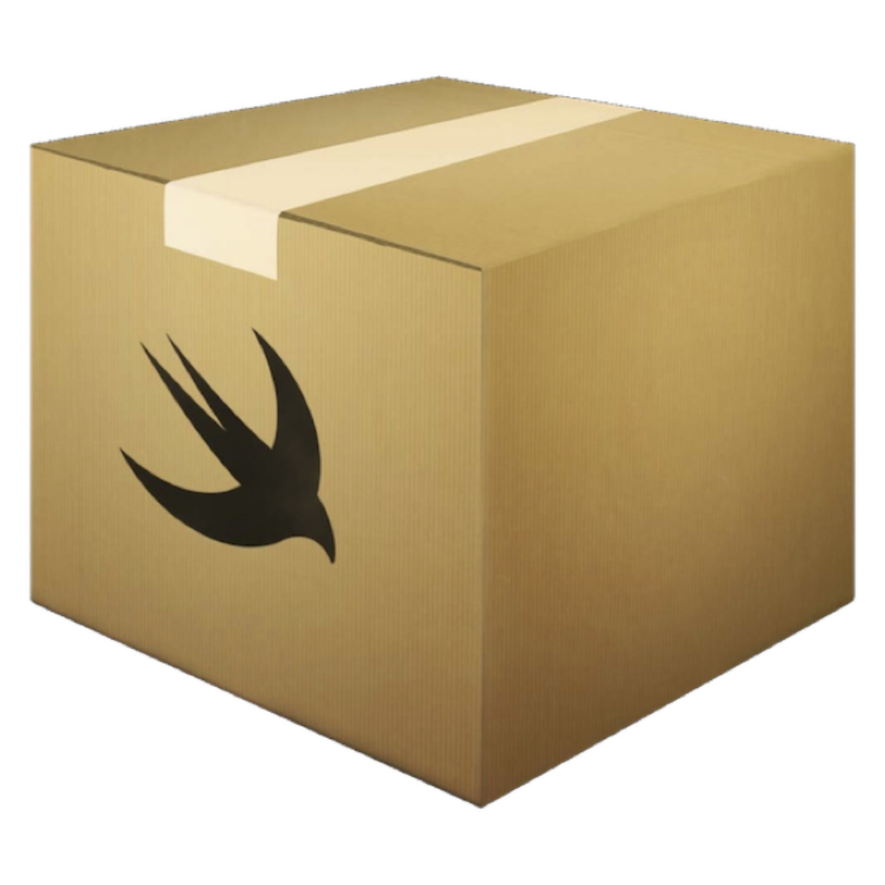

<p align="center">
    
</p>

<p align="center">
    
    
    
    <a href="https://danielsaidi.github.io/EmojiKit"></a>
    
</p>


# MyPackage

MyPackage lets you do a lot of amazing things...


## Installation

MyPackage can be installed with the Swift Package Manager:

```
https://github.com/danielsaidi/MyPackage.git
```


## Contact

Feel free to reach out if you have questions or want to contribute in any way:

* Website: [danielsaidi.com][Website]
* E-mail: [daniel.saidi@gmail.com][Email]
* Bluesky: [@danielsaidi@bsky.social][Bluesky]
* Mastodon: [@danielsaidi@mastodon.social][Mastodon]


## License

EmojiKit is available under the MIT license. See the [LICENSE][License] file for more info.


[Email]: mailto:daniel.saidi@gmail.com
[Website]: https://danielsaidi.com
[GitHub]: https://github.com/danielsaidi
[Bluesky]: https://bsky.app/profile/danielsaidi.bsky.social
[Twitter]: https://twitter.com/danielsaidi
[Mastodon]: https://mastodon.social/@danielsaidi
[OpenSource]: https://danielsaidi.com/opensource
[Sponsors]: https://github.com/sponsors/danielsaidi

[Documentation]: https://danielsaidi.github.io/EmojiKit
[License]: https://github.com/danielsaidi/EmojiKit/blob/main/LICENSE
